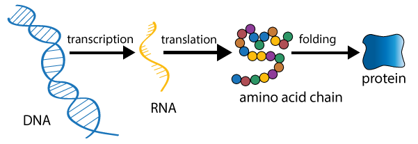

# [Visualizing the Human Genome](https://human-genome.herokuapp.com/)
### UC Berkeley - W209 Data Visualization - Final Project
### Authors:
- Eric Ellestad
- Whitney Fee
- Angel Ortiz Nuñez


## [Link to Project Website](https://human-genome.herokuapp.com/)

## [Link to Youtube Tutorial](https://www.youtube.com/watch?v=fuKv9W4iKtA)


## Division of Responsibilities:
- Whitney Fee:
  - Exploratory Data Analysis
  - Tableau Visualization - Genome Chromosome
  - Tableau Visualization - Chromosome Overview
  - CSS and Website Formatting
  - Definitions


- Angel Ortiz Nuñez:
  - Data Pre-Processing and Data Wrangling
  - Altair Charts - Gene Chromosome
  - Altair Charts - Protein Coding Composition by Chromosome & Genome
  - Altair - Gene Function Charts
  - Altair - Interactivity Across Charts


- Eric Ellestad:
  - Data Collection and Dataset Integration
  - Protein Viewer
  - Altair Charts - Gene Expression Charts
  - Bootstrap and Website Formatting
  - Javascript Interactivity
  - Flask Backend and Website Integration
  - Heroku Platform Integration and Hosting


## Introduction

[The Human Genome Project](https://www.genome.gov/human-genome-project) was completed in 2003 which ushered in the modern genomics era by sequencing an entire human genome for the very first time. In the following two decades, advances in high-throughput genetic sequencing technologies have made DNA sequencing faster, cheaper, and widely available. This has lead to a proliferation of genomic "big data" and the availability of large-scale public databases of detailed genomic information.

The human genome consists of 23 chromosome pairs that include around 20,000 genes and over 6 billion base pairs in total DNA length. Given the challenging scale and complexity of genomic data, this project is an attempt to create an interactive educational visualization of the human genome using real genomic data. In Part 1 we will explore the genome's structure and its components and in Part 2 we will look at gene expression and follow a selected gene's path through the [Central Dogma of Molecular Biology](https://en.wikipedia.org/wiki/Central_dogma_of_molecular_biology) as it gets transcribed from DNA into RNA and then translated into a Protein with a specific bodily function.





Repository Structure:
```
.
├── README.md
├── app.py
├── requirements.txt
├── Procfile
└── Final_Presentation-Visualizing_the_Human_Genome.pdf
└── Final_Report-Visualizing_the_Human_Genome.pdf
└── Visualizing_The_Human_Genome_Tutorial.mp4
├── data
│   ├── genes
│   ├── gene_composition
│   └── genome_genes
└── templates
├── static
│   ├── images
│   ├── css
│   └── js
└── venv
    ├── bin
    ├── lib
    └── pyvenv.cfg
```

## To Run the Flask App Locally:

Clone the repository, navigate to the working directory, and enter these commands into your terminal:
```
source venv/bin/activate
pip install -r requirements.txt
python app.py
```

Then open your browser and navigate to your local host: [http://127.0.0.1:5000](http://127.0.0.1:5000)


## Opensource MIT License

Permission is hereby granted, free of charge, to any person obtaining a copy of this software and associated documentation files (the “Software”), to deal in the Software without restriction, including without limitation the rights to use, copy, modify, merge, publish, distribute, sublicense, and/or sell copies of the Software, and to permit persons to whom the Software is furnished to do so, subject to the following conditions:

The above copyright notice and this permission notice shall be included in all copies or substantial portions of the Software.

THE SOFTWARE IS PROVIDED “AS IS”, WITHOUT WARRANTY OF ANY KIND, EXPRESS OR IMPLIED, INCLUDING BUT NOT LIMITED TO THE WARRANTIES OF MERCHANTABILITY, FITNESS FOR A PARTICULAR PURPOSE AND NONINFRINGEMENT. IN NO EVENT SHALL THE AUTHORS OR COPYRIGHT HOLDERS BE LIABLE FOR ANY CLAIM, DAMAGES OR OTHER LIABILITY, WHETHER IN AN ACTION OF CONTRACT, TORT OR OTHERWISE, ARISING FROM, OUT OF OR IN CONNECTION WITH THE SOFTWARE OR THE USE OR OTHER DEALINGS IN THE SOFTWARE.
